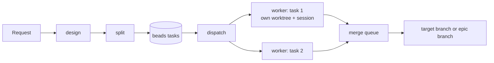

# sdlc

A Claude Code plugin that takes work from an idea to merged code: design it, split it into tasks, and let agents implement each task in its own git worktree, with a record of who did what and what it cost.

It is made for projects that last, not only one-off prompts. Work is kept in beads, so a project's designs, tasks and history build up across sessions, days and people, and any session can pick the work back up.

It builds on [beads](https://github.com/gastownhall/beads) for tasks and [worktrunk](https://github.com/max-sixty/worktrunk) for worktrees. It works with a human in the loop, or fully autonomously.



## For projects that last

A one-off request and a long-running project go through the same flow. What carries a project over time:
- **Work outlives sessions.** Designs are documents in the repository, and tasks, dependencies and progress are beads. Close Claude Code, reboot, or come back a week later: `/sdlc:dispatch` sees what is ready, what is running and what stopped, and carries on.
- **New work builds on old work.** `design` reads earlier design documents and existing beads as prior art, and says whether the new design reuses, extends or replaces them. `split` links new tasks to the ones they depend on.
- **Work can be added at any time.** A new epic with `/sdlc:build`, one task with `/sdlc:create-task`, a finer split of an existing bead with `/sdlc:split`, or a bead created by hand: the queue takes it in.
- **Progress stays focused.** Epics already in progress go first, so started work gets finished before new work starts.
- **The history accumulates.** Every worker attempt stays on its task, with session, model, agents, cost and outcome. `/sdlc:stats` sums it per epic, and `/sdlc:logs` shows what each attempt did.
- **The supervisor holds no state.** Any session, or any person, can take over supervising at any time.

## Features

- **Design before code.** `design` finds prior art (docs, code, existing beads, and connected sources with your permission), removes ambiguity, and writes a design document.
- **Task graphs with real checks.** `split` turns a design, a plan or a prompt into beads tasks. Each task has acceptance criteria, a path scope, dependencies, and a verify command that exercises the behaviour.
- **One task, one worktree, one session.** `dispatch` starts a headless Claude Code session per task, in its own worktree. That worker implements the task, delegating to your installed agents when your configuration says so, then merges and closes it.
- **Merges that can't skip the checks.** Workers merge through `finish-task.sh`. While holding the branch's merge queue, it rebases, runs the verify command, runs the project's own `[pre-merge]` checks (type check, lint, tests, from `.config/wt.toml`) and merges. When that fails, the worker, which has the task's context, fixes it.
- **Review before merging, when a task asks for it.** `--review agent` sends the diff to a separate reviewer session, which asks for changes or approves; `--review human` opens a gate that stops the task until a person reviews the diff and resolves it.
- **Work order.** Epics already in progress come first, then priority. Within an epic, tasks that unblock the most others go first.
- **Crash recovery.** The session id is stored on the task before the worker starts. After a crash or a reboot, `/sdlc:dispatch` resumes each worker's own conversation in its worktree.
- **Integration modes.** Tasks merge straight into `main`, into an epic branch that is merged at the end, or into an epic branch that ends as a pull request.
- **Audit trail in beads.** Every attempt records its session, model, agents, cost, duration and outcome on the task, plus an event bead. `/sdlc:stats` and `/sdlc:logs` read them back.

## Requirements

- [Claude Code](https://code.claude.com) (developed against 2.1.272)
- [beads](https://github.com/gastownhall/beads) `bd` 1.2.2 or later, with the Dolt backend
- [worktrunk](https://github.com/max-sixty/worktrunk) `wt` 0.77 or later
- `git`, `jq`, `python3`, `uuidgen`, and `setsid` and `pgrep`, found on Linux. macOS isn't supported yet (see the [roadmap](docs/roadmap.md)).
- `gh`, only for the `epic-pr` integration mode

## Installation

Pick one.

**Claude Code plugin** (recommended: it includes the hooks, and the skills are named `/sdlc:*`):

```bash
claude plugin marketplace add https://github.com/Igosuki/claude-sdlc && claude plugin install sdlc@claude-sdlc
```

**Skills CLI** (skills only, without the hooks, and named without the `sdlc:` prefix):

```bash
npx skills add Igosuki/claude-sdlc
```

**A prompt** to paste into Claude Code:

```text
install the sdlc plugin at https://github.com/Igosuki/claude-sdlc
```

Then, in Claude Code (run `/reload-plugins` if a session was already open):

```text
/sdlc:setup     # once per machine: checks beads, worktrunk and the other tools, recommends companions
/sdlc:init      # once per project: beads, integration mode, target branch, local settings
```

To try it from a local clone, for one session only:

```bash
claude --plugin-dir /path/to/claude-sdlc
```

## Quick start

The whole workflow in one command:

```text
/sdlc:build add a page that lists the latest orders
```

1. `build` enters plan mode, writes the design into the plan, and asks for your approval.
2. It then writes and commits the design document, splits it into tasks and asks you to approve them, and dispatches.

Step by step:

```text
/sdlc:design add a page that lists the latest orders
/sdlc:split docs/design/latest-orders-page.md
/sdlc:dispatch
```

After a restart, or to pick up work in progress, run `/sdlc:dispatch` again.

## Skills

| Skill | What it does |
|---|---|
| `/sdlc:setup` | Checks this machine for the tools sdlc needs, and recommends companions (rtk, reviewer and specialist agents) |
| `/sdlc:init` | Prepares a project: beads, integration mode, target branch, `.claude/sdlc.local.md`, `.gitignore` |
| `/sdlc:build <request>` | Runs design in plan mode for your approval, then splits it into tasks for your approval, and dispatches them |
| `/sdlc:design <request>` | Finds prior art, clears up ambiguity, and writes a design document |
| `/sdlc:split [docs] [prompt \| bead-id]` | Splits a design, a plan-mode plan or a prompt into a beads task graph, or an existing bead into child tasks |
| `/sdlc:create-task <request>` | Creates a single task that dispatch can run |
| `/sdlc:dispatch [epic]` | Supervises the work: starts workers in work order, follows them, and resumes crashed ones |
| `/sdlc:status` | Shows where workers run, crashed or stopped tasks, and the ready queue |
| `/sdlc:stats [epic]` | Shows cost, duration, models and agents per task and per epic |
| `/sdlc:logs <id>` | Shows what a task's workers did |

## Configuration

Per project and per machine, in `.claude/sdlc.local.md`:

```markdown
---
parallel: 3          # workers at a time on this machine (default 2)
design_dir: docs/specs
workflow: build      # route new work to /sdlc:build automatically
---
```

Shared by everyone using the repository, in beads:

```bash
bd config set custom.dispatch.integration epic-merge   # direct (default), epic-merge or epic-pr
bd config set custom.dispatch.target main              # branch the work ends up in (default main)
bd config set custom.dispatch.review agent             # none (default), agent or human
```

Tasks can carry hints for their worker: `execution_agent_type`, `execution_suggested_model` and `execution_reasoning_effort`. See [configuration](docs/configuration.md).

## Documentation

- [Workflow](docs/workflow.md): design, split, dispatch, the worker lifecycle, integration modes, crash recovery
- [Beads usage](docs/beads.md): task fields, metadata keys, event beads, merge queues, gates
- [Configuration](docs/configuration.md): settings, integration modes, hooks
- [Harnesses](docs/harnesses.md): what is specific to Claude Code, and running on Codex, OpenCode or Ollama
- [Roadmap](docs/roadmap.md): what is planned, including GitHub Issues as a tracker
- [Development](docs/development.md): repository layout, conventions, tests

## Other harnesses

sdlc runs on Claude Code today. The Claude-specific parts sit in a few places: how a worker session is started and resumed, how its log is read, and the hooks. Codex CLI and OpenCode have close equivalents for each, and Ollama can serve local models to all three. [Harnesses](docs/harnesses.md) maps them out.

## Roadmap

Highlights from [the roadmap](docs/roadmap.md):
- GitHub Issues, and other trackers, alongside beads
- worker sessions on Codex CLI and OpenCode, and local models through Ollama
- several machines sharing the queue
- dedicated QA agents, and custom statuses
- deduplication of similar tasks

## Inspirations

- [metaswarm](https://github.com/dsifry/metaswarm)
- [The Claude Protocol](https://github.com/AvivK5498/The-Claude-Protocol)

## License

[MIT](LICENSE)
