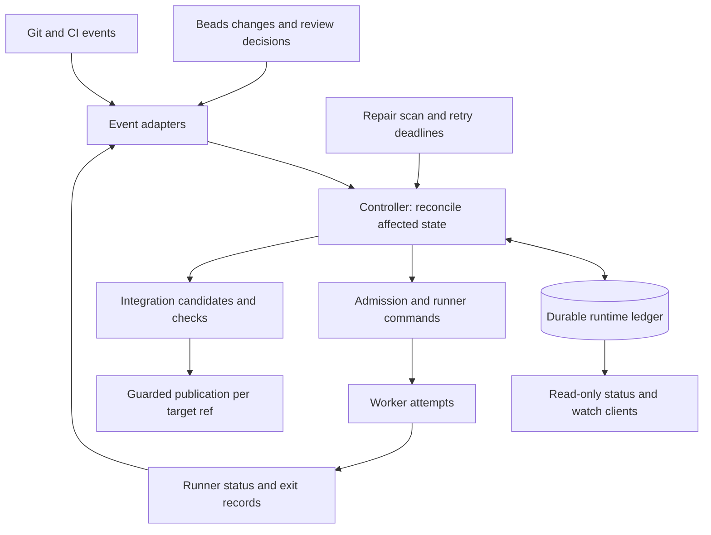

# Durable dispatch and integration controller

Status: proposal, 2026-09-16. No runtime changes are implemented by this document.

## Decision

Move routine scheduling from the supervising model session into a durable reconciliation controller. Watches become read-only subscriptions. One scheduling authority manages a capacity pool across all selected epics; workers and independent integration checks run concurrently. The controller persists actions before executing them and recovers by comparing those actions with runner and Git state.

Use events for prompt reaction, plus one bounded repair scan for missed notifications. Use an established consensus-backed coordination service for failover across hosts from the first release. Leader election, idempotent operations, and fencing are separate requirements. Local operating-system locks remain useful inside runners, but cannot provide cluster ownership.

The existing [remote-workers hypothesis](remote-workers.md) remains useful for runner and artifact options. This proposal revises its suggestion to wait until multiple repositories and hosts exist before extracting the unattended loop: duplicate supervision and capacity races already exist locally. It also requires changes to the finish/merge contract before claiming safe remote failover.

Confirmed requirement: support workers on multiple hosts and recovery from the loss of an entire machine from the first release. A local-only deployment is a development convenience, not an initial production milestone or an acceptable substitute for this requirement.

## First-release availability contract

Tolerate abrupt loss of any one plugin-managed host, including a host running the active controller, a storage member or workers. Surviving workers continue; scheduling and integration resume automatically on surviving infrastructure once ownership and runtime inventory have been reconciled. Spare execution capacity must exist for replacement workers. This contract covers one host failure, not simultaneous loss of a quorum, an entire region, or an external Git/model provider.

| Component | Required deployment property |
|---|---|
| Controllers | At least two instances on separate hosts, with one active authority per capacity pool and automatic takeover. |
| Runtime ledger and election | A quorum across independent hosts; a three-voter deployment can retain a majority after one host fails. Acknowledged intents and reservations survive that failure. |
| Beads authority | A tested, durable failover arrangement that preserves acknowledged task changes and prevents two writable authorities. A standalone Dolt server or asynchronously synchronized writable clones do not satisfy this contract. |
| Worker runners | Inventory and idempotent operation lookup survive controller loss. Confirmed infrastructure termination or fencing enables automatic replacement after worker-host loss. |
| Workspaces and transcripts | Recoverable from another host using replicated storage or durable checkpoints; availability must not depend on the failed worker's local disk. |
| Integration and publication | Candidate manifests and check evidence survive host loss. The publication authority is replaceable, and stale publishers cannot advance target refs after takeover. |
| Event ingress | No sole event receiver or local-only queue whose loss stalls progress. Durable replay or reconciliation repairs missed delivery. |

Use one coordination backend for runtime ownership, reservations and action intents where practical. Adding a separate message broker is not required for event-driven operation. Beads remains the desired-work authority, with an explicit recovery protocol between it and the runtime ledger; choosing a consensus store does not automatically make Beads highly available.

Acknowledged control-state changes have zero data loss for the specified single-host failure. Worker recovery resumes from the last durable checkpoint. Work since that checkpoint can be lost, and exact continuation of an interrupted model call is not promised. Record checkpoint identity and freshness; never report an unreplicated local transcript as recoverable. Recovery time is bounded by failure detection, fencing, takeover/reconciliation and restore/start time; numerical targets must be set and tested against the selected infrastructure.

Meeting this design requires selecting and validating the Beads failover mechanism, runner fencing mechanism, artifact backend and publication authority. These are first-release architecture prerequisites. In particular, do not claim that an unverified Dolt replication topology preserves acknowledged writes or provides automatic safe failover.

## Current failure surfaces

These are source-inspection findings, not reproduced production incidents.

| Current path | Consequence |
|---|---|
| `commands/dispatch.md`, Follow: a model reacts to watch lines by calling dispatch | Refilling capacity depends on a live supervising session. |
| `scripts/watch.py:46`: every watch runs gate checks, PR closure, and review resumes globally, even with an epic filter | Observers duplicate mutation work. Hook failures and their stderr are discarded. |
| `scripts/watch.py:111`: idle means no live worker and no ready task | Pending external gates can outlive the watcher; it is not a persistent controller. |
| `scripts/dispatch-next.sh:33`: count, select, then launch | Concurrent dispatchers can exceed the capacity limit even if they claim different tasks. |
| `scripts/run-task.sh:114`: claim uses the default actor | Installed `bd update --help` says a claim by the same actor is idempotent. Two dispatchers using that actor are not mutually excluded by this claim. |
| `scripts/run-task.sh:87`: create epic integration resources before claiming the task | Concurrent first dispatches can race during epic initialization. |
| `scripts/merge-queue.sh:37`: read key, create bead, write key | Concurrent initialization can create different lock identities for one branch. |
| `scripts/merge-queue.sh:51`: holder is a task ID, and an existing holder succeeds again | Two executions of the same task can both believe they own the merge queue. |
| `scripts/merge-queue.sh:67`: read holder, then unconditionally clear | Release is not conditional on the ownership version remaining unchanged. |
| `scripts/resume-task.sh`: inspect process, then launch | Recovery and review resumes need the same admission and deduplication protocol as initial launches. |
| `scripts/finish-task.sh:248`: merge precedes Beads closure; retry rejects an already-integrated branch at line 91 | A crash between publication and bookkeeping cannot be repaired by simply rerunning finish. |
| `scripts/record-task.sh`: identify execution by task metadata and select a result from the reused session log | A stale wrapper or an old result can be attributed to the current execution. |

Existing tests exercise watcher classification and graph ordering. Those are useful components, but do not establish concurrent dispatch, leader failover, or crash-safe publication guarantees.

## Ownership and persistence

Separate desired work, execution, and delivered code. They answer different questions.

| Authority | Owns |
|---|---|
| Beads | Task descriptions, acceptance, dependencies, priorities, review decisions, epic membership and desired cancellation. |
| Controller runtime ledger | Admission, task generations, attempts, capacity reservations, action intents, integration candidates, event checkpoints and retry deadlines. |
| Runner | Whether a particular attempt exists, is executing, has stopped, and where its artifacts are. |
| Git publication authority | Which tested candidate was committed to a target ref. |

Beads runtime metadata becomes a projection of the ledger, not a second independent admission authority. Persist pending projection actions and retry them idempotently. A crash between a ledger update and a `bd` update must neither launch a second worker nor lose a successful integration. Do not claim that writes to Beads, the runner, and Git form one database transaction.

All plugin launch, resume, cancel and finish paths must use the controller protocol. Manual task changes remain inputs; manual launches through old scripts would bypass the guarantees. Recheck current task eligibility before starting a reserved attempt. Cancellation is complete only after runner termination and publication revocation are acknowledged, not when an observer first sees a changed bead.

Required durable identities:

- `task_generation`: changes when a task is explicitly retried/reopened for new execution.
- `attempt_id`: unique execution identity; a resumed conversation gets a new attempt even if its Claude session ID is reused.
- `action_id`: stable key for a specific launch, cancellation, projection or publication operation.
- `leader_epoch`: monotonically ordered ownership generation for the scheduling authority.
- `candidate_id`: binds repository, target ref, expected base SHA, ordered source SHAs and verification configuration.

Attempt outcomes, log offsets and costs are attributed to the attempt, not merely to an append-only conversation log. A result from an earlier resume must not finish a newer attempt. Duplicate delivery of a result cannot release capacity twice.

## Controller and observers

Multiple status clients subscribe to the same service; they never run gate checks or resume workers. Closing a client does not stop scheduling. An idle service sleeps until an event or timer arrives. Stopping admission is an explicit persisted pause/drain command.

A reconciliation pass performs short decisions and durable transitions, then hands long work to runners. It does not wait inside the event loop for model calls, tests, human review or merge locks. Coalesce events by affected entity, serialize overlapping decisions, and bound action concurrency. Persist errors with operation identity, retryability and next retry time; notify a model or person when judgment is required.

Beads main currently documents an optional ordered event journal with replay cursors and an SSE endpoint. Its hooks are best-effort notifications. This installation rejects both `bd events` and `bd activity`, so the first implementation must not assume those APIs exist. Start with worker exit records and mutation notifications plus a repair scan. A version-pinned journal adapter can replace graph polling once available and verified. Journal enablement must cover every writer. [Beads events journal](https://github.com/gastownhall/beads/blob/main/docs/reference/events-journal.md)

When consuming a journal, persist the dirty-work item and checkpoint together before acknowledging it. On an expired cursor, take a fresh snapshot with a stream boundary that covers concurrent writes, then resume; do not silently skip the gap. External webhook delivery is also deduplicated and periodically checked against authoritative state. Maintain one gate/PR checker for the admitted scope, with backoff, rather than one per observer.

## Admission and slot refill

Every initial start, resume, retry, reviewer and repair worker passes through the same capacity authority. Resource budgets distinguish model sessions from test executors; waiting for review or for integration consumes no model slot after the process exits. Keep reservations for launching, running, stopping and uncertain attempts until their resource use is resolved.

1. Reconcile runner completions and uncertain operations.
2. Select eligible work across the admitted set of epics.
3. Atomically verify the current leader, task generation, absence of another active attempt, and available capacity; create the attempt, reserve capacity and persist launch intent.
4. Call runner `ensure_started(action_id, attempt_id, specification, epoch)`.
5. If the reply is lost, query/retry that same action. Do not allocate a new attempt merely because a request timed out.
6. On authoritative process termination, record the outcome and release its reservation once. Immediately enqueue reconciliation of newly eligible tasks and free capacity.

The runner must implement idempotent creation and inventory lookup by attempt ID. A command that only starts a process and returns a PID is insufficient. On each host, use an attempt guardian with an exclusive attempt lock, durable launch/exit records, and process identity including host and boot identity; it must survive controller replacement. Persist the cluster attempt identity and recoverable artifacts outside that host's failure domain. If launch status is uncertain, retain the reservation and investigate the same attempt. Do not send the same uncertain launch to another host merely because the original runner is unreachable.

Repository admission scopes are persisted sets: dispatching epics A and B admits their union. An observer's `--epic` filter only filters display. A machine capacity pool must account for every registered repository using that machine, or the limit must be documented as per-repository rather than per-machine.

Admission checks both global limits, such as model-session concurrency, and the selected host's available resources. A failed host contributes no schedulable capacity. Its uncertain attempts retain their global reservations until termination or execution fencing is established; then replacement attempts reserve capacity on surviving hosts through the same transaction protocol.

For the first version, retain existing ordering within an epic, but use round-robin turns with configurable weights across ready epics in the same priority class. Add aging so a continuously replenished epic cannot starve others. Count actual model sessions, including reviewers; opaque worker-created subagents require a bounded per-worker allowance or must be outside an explicitly stated budget. Mesos-style dominant-resource fairness is only needed if allocating multiple independently scarce resources, not for a homogeneous slot count.

## Coordination and failure guarantees

The historical pattern is active/passive framework schedulers, persistent launch intent, idempotent status processing and reconciliation on takeover. Mesos explicitly warns that a disconnected worker can still be alive and reach external systems. [Mesos HA framework guide](https://mesos.apache.org/documentation/latest/high-availability-framework-guide/)

Reconciliation compares durable intent with runtime inventory on startup, on ambiguous results and periodically. Retry unresolved observations with capped exponential backoff and jitter; coalesce overlapping scans. Events provide latency, while reconciliation supplies recovery. [Mesos reconciliation](https://mesos.apache.org/documentation/latest/reconciliation/)

| Deployment | Mechanism | Failure boundary |
|---|---|---|
| Development only: one host | Supervised service; OS-held controller lock per capacity pool; local transactional ledger and attempt guardians | Controller/session crashes recover automatically. Disk or host loss stops service. Does not meet the release requirement. |
| Required from first release: multiple hosts | Active/passive controllers; quorum-backed ownership lease and durable ledger; runner and publication fencing; recoverable Beads and artifacts | A surviving controller can take over after reconciliation. A minority partition cannot admit or publish work. |

For distributed coordination, use an established implementation such as an etcd-backed lease and transaction protocol (Raft beneath it), or ZooKeeper's election recipe when that infrastructure already exists. Do not implement consensus in plugin scripts. The controller checks ownership within each authoritative transaction; watch notifications alone do not grant ownership. [etcd API guarantees](https://etcd.io/docs/v3.6/learning/api_guarantees/)

Start with one active scheduling authority per capacity pool, backed by replacements on separate hosts. Multiple active schedulers would still need the same atomic capacity and attempt transactions, while making fairness and admission harder to reason about. The active leader handles short decisions; execution remains parallel. Independent pools can acquire independent ownership later.

Each command carries an epoch and each protected resource rejects stale ownership. Merely checking a lease in `finish-task.sh` before running Git leaves a check/use race. Runners and the publication authority must enforce ownership at the operation boundary. Already accepted operations remain durable and recoverable during takeover; the new leader adopts or resolves them before issuing conflicting work.

A missing heartbeat means `unreachable`, not `dead`. To prevent overlapping live worker attempts caused by scheduling or recovery, do not replace an uncertain worker until termination or infrastructure fencing is confirmed. This may pause that task during a partition. A policy that permits replacement after a timeout can restore progress sooner, but may temporarily run duplicate workers; publication fencing can protect accepted results, not undo that cost. Default to the strict policy requested here.

Distinguish execution fencing from publication fencing. Revoking permission to merge protects the target branch but does not stop the old process from consuming model tokens. Replacement without overlapping live worker attempts therefore requires a trusted runner or infrastructure control plane to confirm that the old execution has stopped or can no longer execute. If that confirmation is unavailable during a partition, preserve uncertainty for the affected task while unrelated work continues on reachable hosts within the remaining budget.

This does not promise zero repeated computation: restoring a checkpoint can repeat subsequent work, and a model request already submitted may continue at the provider after its client dies. Preventing overlap or duplicate billing at that boundary requires verified provider cancellation or idempotency support. Track those costs separately from duplicate worker launches rather than claiming runner termination cancels remote requests.

Scheduler replicas alone do not remove all single points of failure. The runtime ledger needs quorum durability across failure domains; Beads needs a tested storage/failover arrangement; transcripts and workspaces need durable storage or an explicit loss/restart policy; the Git authority and runner control path need recovery. A single shared Dolt server does not meet host-failure availability by itself. Until those contracts are proven, describe the distributed design as a target, not a delivered HA guarantee.

## Testing and merging multiple epics

Separate implementation attempts from integration jobs. Finishing implementation submits an immutable source revision and ends the model process. Integration runs without an idle model waiting for a lock. A failed check or conflict creates one repair action tied to that candidate and its diagnostics; repairing it uses the normal admission path.

Preserve the three integration modes:

- `direct`: task candidates enter the target branch's integration queue.
- `epic-merge`: task candidates enter their epic branch; completed epic revisions enter the final target queue.
- `epic-pr`: the epic revision is submitted as a PR; provider merge confirmation and required checks determine delivery.

Different epic branches can verify and integrate concurrently. Mutations to one target ref serialize, even if their tests run concurrently. Dependencies are satisfied for execution only when the required code is present in the selected base or explicitly included in the candidate. Closing a task on epic A's branch does not make its code available to a dependent task based on epic B's branch.

Each candidate records the expected target SHA, ordered source SHAs, resulting candidate SHA, task generations, required reviews, verification commands/configuration and check results. Run acceptance and project checks against that exact candidate. Any source, target, required review or verification-input change invalidates the affected evidence. An unchanged patch ID alone does not prove a rebase conflict resolution was reviewed or that a changed target was tested.

Support two explicit policies:

| Policy | Behaviour |
|---|---|
| Independent epics | Build and test each candidate on the target state it will actually follow. Publish serially; rebuild/retest when that state changes. |
| Atomic batch | Freeze selected epic heads, combine them in a deterministic order, test the combined candidate, then advance one target ref once. If the batch fails, none of it lands; isolate the failure before forming a new candidate. |

Atomic batching means one ref update in one repository, not a cross-repository transaction. If batch membership changes, create a new candidate and verify it. A speculative merge train is a later optimization: downstream candidates include predecessors, and a failed predecessor invalidates every dependent candidate. It is unnecessary for the initial correctness change and creates avoidable test work.

Publication must validate both expected target SHA and current authorization. Keep a single guarded publication boundary per target. Workers may submit task branches, but cannot independently update integration refs under the distributed guarantee. An ordinary fast-forward push is not a fencing protocol: a stale worker's commit might still fast-forward successfully. A database lease check followed by an unguarded remote push is also insufficient. The host must enforce authorization at acceptance, or the publishing executor must be fenced and drained before replacement.

Persist publication intent before changing the ref. After a crash, inspect the ref and recorded candidate identity to determine whether publication already succeeded; retry only the missing bookkeeping. If another allowed update moved the ref further, verify the exact candidate's inclusion and publication evidence. Close each affected bead idempotently after delivery is established. Beads closure can lag Git; it cannot be atomically committed with Git, and that lag must not trigger reimplementation.

## Contracts to prove before implementation is considered safe

| Scenario | Required result |
|---|---|
| Two dispatch clients, one free slot | One reservation and one admitted attempt, across different tasks as well as the same task. |
| Launch accepted, response lost, controller killed | Successor adopts the same attempt; no second process. |
| Active controller's entire host is powered off | Standby takes over without a user session; surviving attempts are adopted and free capacity refills. |
| One quorum member's host is lost after acknowledging an intent | Intent and reservation remain durable; the surviving majority continues. |
| Beads primary host is lost after acknowledging a task change | The replacement preserves the acknowledged change, prevents concurrent writable primaries and restores scheduling automatically. |
| Worker host is powered off mid-task | After confirmed termination/fencing, a new attempt restores the last durable checkpoint on another host within capacity limits. |
| Old worker host returns after replacement | Its obsolete attempt cannot restart, publish, or overwrite the replacement's checkpoints or outcome. |
| Publisher host dies before or after the target ref update | Successor resolves the durable action against the target before retrying; no stale publisher can later advance the ref. |
| Controller crashes before runner receives launch | Durable action is retried with the same identity. |
| Worker exits while every observer is disconnected | Capacity refills without opening a model supervisor. |
| Review resolved when no worker is running | Service wakes and resumes through normal admission. |
| Duplicate/reordered result events | Monotonic attempt outcome; one capacity release; old attempts cannot finish new ones. |
| Watch event lost or replay cursor expired | Repair reconstructs pending work without duplicate effects. |
| Lease expires while old controller/worker is paused | Old publication and conflicting launch commands are rejected after takeover. |
| Worker host is unreachable | Strict mode preserves uncertainty and avoids replacement until fenced/stopped. |
| Target moves during checks | Candidate cannot publish using stale verification evidence. |
| Two epics pass separately but their combination fails a required check | The failing combined candidate is not published; passing declared checks is not proof that no interaction bugs exist. |
| Batch ref update succeeds, process dies before closing beads | Recovery closes the delivered tasks without merging again. |
| One epic continually gains tasks | Other eligible epics receive capacity under the declared fairness policy. |
| Beads, ledger or runner unavailable | Degraded state and retry deadlines are visible; no inference that uncertainty means completion. |

## Implementation boundaries

The existing Python task-graph functions can remain the scheduling policy layer. Language choice is secondary to the atomic contracts. The first release needs remote coordination, runner and storage clients; evaluate dependencies and service runtime against those requirements rather than restricting production to a local standard-library controller.

Replace `dispatch-next.sh` with an admission client and `watch.py` with an observer. Route `run-task.sh`, `resume-task.sh` and review resumes through durable attempts. Replace polling merge claims with candidate jobs and guarded publication. Keep planning skills, Beads task authoring and worker implementation prompts as the user-facing workflow. Crash diagnosis that needs judgment remains a model/human action; routine refill and known transient recovery do not.

Cutover must drain or adopt existing workers before enabling a second admission path. Never run legacy dispatch and the new controller as independent authorities. The research note [scheduler coordination sources](scheduler-coordination-sources.md) records the primary-source basis and separates historical behaviour from this proposal.

Deployment scope is settled: multiple hosts and host-failure availability from the first release. Remaining choices are the concrete coordination/storage topology, Beads failover mechanism, runner and publication fencing, checkpoint policy and measured recovery-time target. Their implementations must satisfy the failure contract above before production release.
