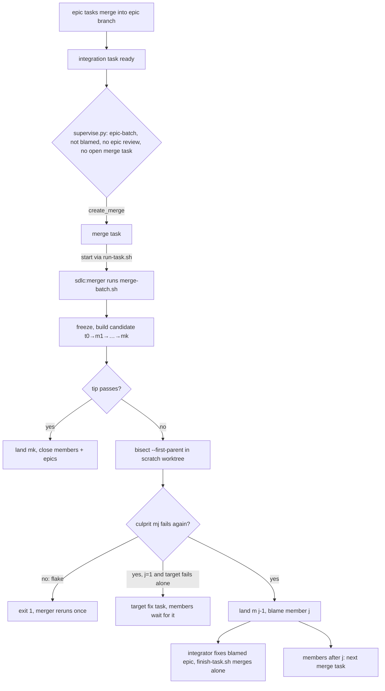

# Merge batches: combine finished epics, bisect failures, dispatch fixes

Research date: 2026-09-17. Status: design agreed, not implemented. This document holds everything needed to implement it: decisions, prior art, contracts, the change for each file, with anchors in the current code, the tool facts that were checked, and the tests.

## Why

In `epic-merge` mode each epic integrates on its own. Its integration task, run by `sdlc:integrator`, goes through `finish-task.sh`: it rebases the epic branch onto the target, runs the epic's verify commands (`verify.sh --no-pre-merge <epic>`), and then `wt merge` runs the project's pre-merge checks and fast-forwards. Two problems:

- **Throughput:** N epics that finish together run N full test suites back to back through the target's merge queue. [remote-workers.md](remote-workers.md) §5 puts that at 6 merges an hour for a 10-minute suite.
- **Interactions:** epic B is tested on the target after A lands, but A's verify commands never run again, so B can break them unnoticed.

Merge batches test several finished epics as one combined candidate. A green candidate lands in one fast-forward. A red one is bisected over its per-epic merge commits: the epics before the first bad merge land, the culprit goes back to its integrator with a diagnosis, and the epics after it wait for the next batch.

[distributed-mode.md](distributed-mode.md) ("Atomic batch") and [scheduler-coordination-sources.md](scheduler-coordination-sources.md) (item 6) already asked for this. Gas Town's Refinery, described in [remote-workers.md](remote-workers.md), is the same idea.

## Decisions

Agreed with the user on 2026-09-17:

| Question | Decision | Rejected |
|---|---|---|
| Who runs a batch | A `sdlc:merger` agent session owning a merge task, running `scripts/merge-batch.sh` for the mechanics. The agent never edits code. | A script started directly by `supervise.py`: it would need its own process tracking, crash handling, logs and person-needed reporting outside the worker lifecycle. |
| What happens to a culprit | Land the passing prefix; the culprit goes to its integrator; epics after it wait for the next batch. | Land nothing until every member passes (bors-style atomic batch). |
| Bisect depth | Epic level: `git bisect --first-parent` over one merge commit per epic. | Also bisecting inside the culprit epic to name the task. |
| How it is switched on | A new integration mode, `epic-batch`. | An explicit `/sdlc:merge <epic...>` skill. |
| Who fixes a broken target | An agent: the batch creates a fix task for the target, and the members wait for it. | A person. A person is needed only when the pre-merge checks aren't approved on the machine. |

Separation of roles: the **merger** combines, tests, bisects and assigns blame. The **integrator** keeps its current job: make one epic merge into the target, fixing whatever stops it.

## Prior art

| Source | What it does | Taken here |
|---|---|---|
| [Zuul dependent pipelines](https://zuul-ci.org/docs/zuul/latest/gating.html) | Tests A, A+B, A+B+C in parallel. A failing item is dequeued and the items behind it retest without it. A merge conflict is reported as `MERGE_CONFLICT` and dequeued without running jobs. `job.attempts` retries only infrastructure failures. | Cumulative prefixes; conflicts evicted untested. |
| [GitLab merge trains](https://docs.gitlab.com/ci/pipelines/merge_trains/) | Cumulative pipelines, up to 20 in parallel. A failing MR is dropped and the pipelines behind it restart without it. An MR that can't be combined is dropped and must be rebased. | Same eviction model. |
| [GitHub merge queue](https://docs.github.com/en/repositories/configuring-branches-and-merges-in-your-repository/configuring-pull-request-merges/managing-a-merge-queue) | Each queued PR's temporary branch includes the PRs ahead of it. A failing PR is removed and the branches behind it rebuilt. Conflicts are removed, with a notification. | Same. |
| [Gas Town Refinery](https://github.com/gastownhall/gastown/blob/main/docs/design/architecture.md) ([discussion](https://github.com/gastownhall/gastown/discussions/2219)) | Rebases merge requests as a stack on main, tests the tip, fast-forwards all of them on green, and bisects on red by testing the midpoint prefix. Failed ones are "isolated and either fixed inline or re-dispatched". Its v0.9.0 release notes say batching shipped, but architecture.md still marks it "Phase 2 (Blocked)". | The overall shape. Fixes are re-dispatched to the integrator, never made by the merger. One merge commit per epic instead of a rebased stack: a task's commits were never tested on top of other epics, so a commit-level bisect would stop on commits that don't build. |
| [bors-ng](https://bors.tech/documentation/) (archived 2024) | One merge commit on `staging` per batch; a failed batch splits in two and both halves requeue, recursively. Flakes: `timeout_sec` and a manual `bors retry`. | Not taken (see below). |
| [Mergify batches](https://docs.mergify.com/merge-queue/batches/) | `batch_size`; a failed batch splits into parts retested until one PR remains, capped by `batch_max_failure_resolution_attempts`. | Not taken (see below). |
| [Trunk batching](https://docs.trunk.io/merge-queue/optimizations/batching), [pending failure depth](https://docs.trunk.io/merge-queue/optimizations/pending-failure-depth) | Recursive halving. With optimistic merging, a later passing batch that contains the failed one lands both. | Not taken (see below). |
| [Aviator batching](https://docs.aviator.co/mergequeue/concepts/batching) | A failed batch is requeued in halves. Parallel mode builds speculative draft PRs. | Not taken (see below). |
| [git bisect](https://git-scm.com/docs/git-bisect), `--first-parent` since [git 2.29](https://github.blog/open-source/git/git-2-29-released/) | Under `--first-parent`, "the merge commit will be identified as introduction of the bug and its ancestors will be ignored". `bisect run` exit codes: 0 good, 125 skip, 1–127 bad, anything above 127 aborts. `refs/bisect` is per worktree. | The epic-level bisect. The check step exits 255 on errors that aren't a failing check. |
| [LUCI Bisection culprit verification](https://pkg.go.dev/go.chromium.org/luci/bisection/culpritverification) (Chromium) | Reruns the test at the suspect and at its parent before acting on a culprit. | One rerun at the first bad merge; its parent already passed during bisect. |
| Octopus merges ([Torvalds](https://ratatoskr.run/git/2016/06/7278200/t)) | One commit for all branches. Bisect can't split it, and non-trivial conflicts are refused. | Not taken. |
| [Kubernetes Tide](https://github.com/kubernetes/test-infra/issues/13551) | No bisection; one failing batch was retested more than 270 times. | Every red batch lands, blames, or makes its members wait for a target fix, so batches can't loop. |
| [Uber SubmitQueue](https://blog.acolyer.org/2019/04/18/keeping-master-green-at-scale/) (EuroSys'19) | A speculation tree plus a model that predicts build success; rejects batching because it needs manual conflict resolution. | Not taken: far beyond this scale. |

**Why not halving.** bors, Mergify, Trunk and Aviator split a red batch into halves, each tested against the base. Two epics that only break together can end up in different halves: both halves pass, and the culprit is never found. Stacked prefixes don't have that gap. The first failing prefix names the later epic of the breaking pair, which matches queue semantics: the one that arrives second adapts.

Not found: any agent orchestrator that tests several agent branches together or bisects them. That covers claude-squad, uzi, container-use, Conductor, OpenHands, VS Code 1.136 "Agent Merge" (one PR at a time) and beads-based orchestrators.

## Components

| Name | What it is | What it does |
|---|---|---|
| `epic-batch` | integration mode | Like `epic-merge`: tasks merge into the epic branch `<epic-id>`, and the epic's first dispatch creates the branch and an integration task. The difference is that an epic whose tasks are done waits for a merge batch instead of starting its integrator. |
| merge task | bead | One batch. `--type task`, no parent, metadata `dispatch_role=merge` and `members=<integration task ids, space-separated, in merge order>`. The supervisor creates it; dispatch starts it like any task. |
| `sdlc:merger` | agent, `agents/merger.md` | The worker session that owns a merge task. It runs `merge-batch.sh`, reruns it once when asked, writes a diagnosis for whoever fixes what the batch found, and records what a person must do. It never edits code, commits, merges or closes. |
| `scripts/merge-batch.sh` | script | The mechanics: freeze, build the candidate, test, bisect, verify the culprit, land, blame, close the merge task. |
| blamed integration task | bead state | An integration task with `dispatch_blamed_by=<merge task>` and `dispatch_blamed_with=<epic ids that landed in that batch, space-separated, possibly empty>`. It is dispatched to `sdlc:integrator` individually and merges alone, as in `epic-merge`. |
| target fix task | bead | Created by `merge-batch.sh` when the target fails its own pre-merge checks: a task with no parent (direct mode), verify command `wt hook pre-merge`. Every member depends on it, so none is batched until it closes. |

## Flow



1. Tasks of epic E merge into branch E as today. E's integration task is ready once they are all closed: `run-task.sh:96-97` adds a dependency on each of them.
2. **Brain.** In `supervise.py`, `Brain.decide` calls a new `_decide_batches`. It checks that no merge task is open (`dispatch_role=merge`, status not `closed`). Then `tasks.batch_candidates(all, ready, under_ids)` returns the ready integration tasks that:
   - belong to an epic whose `metadata.dispatch_integration` is `epic-batch`
   - have no `dispatch_blamed_by`
   - belong to an epic with no `metadata.review` (a reviewed epic integrates alone with its review, as in `epic-merge`)
   - are in scope for `under_ids`

   They come back in work order. If there are any, the action is `{"kind": "create_merge", "tasks": [...]}`.
3. **Arm.** `execute_action` handles `create_merge`: `bd create "Merge <n> epics into <target>" --type task --description "..." --metadata '{"dispatch_role":"merge","members":"<ids>"}' --silent`. The target comes from `settings.sh target`. The settle round's `_decide_starts` then starts the merge task through `run-task.sh`, within the parallel limit.
4. **Start.** `run-task.sh` for role `merge`: no verify command required, no epic, base = target, branch = the merge task id, `wt switch --create <id> --base <target>`. The prompt names the target and the members. `start-worker.sh` sets:
   - `--agent sdlc:merger`
   - `--allowedTools "Bash(<scripts>/merge-batch.sh *)"`
   - `DISPATCH_FINISH=<scripts>/merge-batch.sh`
   - `BASH_DEFAULT_TIMEOUT_MS` and `BASH_MAX_TIMEOUT_MS` (see Tool facts)
5. **Mechanics.** The merger runs `merge-batch.sh "$DISPATCH_TASK"` (next section).
6. **Merger.** Acts on the exit code (see Merger agent).
7. **Fix.**
   - **A blamed integration task** is dispatchable. `sdlc:integrator` rebases E onto the new target and fixes it. `finish-task.sh` runs E's checks plus the verify commands of every epic in `dispatch_blamed_with`, then merges E alone.
   - **A target fix task** is dispatched to `sdlc:worker` in direct mode. Once it merges, its dependents are ready again.
8. **Next batch.** Members that were left out are still ready and unblamed. Once the merge task closes, the next round creates a new merge task with them and whatever else became ready.

**Progress.** Every red batch ends in one of three ways, so a batch can't be retried endlessly:
- It lands or blames its first member.
- The target itself is broken: a target fix task is created, and the members wait for it.
- The run didn't finish: exit 1, rerun once, then the merge task stops.

A member left out after conflicting with another member can only conflict with the target in the next batch, and is blamed then.

## merge-batch.sh

```
Usage: merge-batch.sh <merge-task-id>
       merge-batch.sh --check <merge-task-id>
```

Its shape follows `finish-task.sh`: a `usage()` heredoc with `-h`, the `show`/`get` helpers, and a `person()` helper that prints "needs a person: …" and exits 3. It is bash, like the other lifecycle scripts; any logic that grows beyond jq goes in `tasks.py`.

### Refusals (exit 2)

Invalid arguments, a bead that isn't `dispatch_role=merge`, or a merge task without a dispatched worker. For the last one, use the same check as `finish-task.sh:72`: `in_progress`, a session, and no outcome recorded.

### Steps

1. **Freeze.**
   - Take the target's merge queue: `merge-queue.sh acquire <target> <merge-task> --timeout 21600`. A timeout exits 1.
   - `trap` on EXIT releases the queue and removes the scratch worktree.
   - Drop members that are no longer ready: closed, or blocked by a non-closed task. `create-task.sh` adds that dependency when a task is added to an epic; see its guard change.
   - In the candidate worktree (found by branch, as `finish-task.sh:76` does): `git reset --hard <target>` and `git clean -fd`. Leave out `-x`, so ignored dependency caches stay. `t0` = the target SHA.
   - Record each remaining member's epic head: `git rev-parse <epic-id>`, where the epic branch name is the epic's `metadata.dispatch_branch`.
2. **Already landed.** A member whose epic head is an ancestor of `t0` (`git merge-base --is-ancestor`) is closed as in step 6.3, untested. This happens after a crash between landing and closing.
3. **Build.** For each member, in `members` order:
   - `git merge --no-ff --no-edit -m "Merge <epic-id>: <epic title>" <epic-branch>`.
   - On a conflict: `git merge --abort`, then check the epic against `t0` alone with `git merge-tree --write-tree --quiet t0 <epic-branch>` (exit 1 = conflicts). If it conflicts with `t0` too, blame it (step 7) with the reason "conflicts with <target>". Otherwise leave it out, unblamed, for the next batch.
   - Record the merge commit SHA of each included member: `m1 … mk`.
4. **Test the tip** in the candidate worktree:
   - For each included member's epic: `verify.sh --no-pre-merge --worktree <candidate> <epic>`.
   - Then `wt hook pre-merge -C <candidate>`.
   - Unapproved checks (`needs_approval`, copied from `finish-task.sh:62`): exit 3.
   - Any other failure goes to step 5.
   - If nothing was included (every member left out or blamed), skip to step 8.
5. **Bisect** on a red tip.
   1. **Scratch worktree:** `wt switch --create <merge-task>-bisect --base <mk> --no-cd`. Going through `wt` runs the project's post-start hooks (dependency installs), the same as task worktrees get. A stale one left by a killed run is removed first with `wt remove -f -D <merge-task>-bisect`.
   2. **Run** in the scratch worktree: `git bisect start --first-parent <mk> <t0>`, then `git bisect run <scripts>/merge-batch.sh --check <merge-task>`.
      - `git bisect run` exits 0 when it finds the first bad commit. Read `git rev-parse refs/bisect/bad` (per worktree) → `mj` → member j.
      - Any non-zero exit means the bisect aborted: `git bisect reset` and exit 1. If the aborted step printed "needs a person", exit 3.
   3. **Verify the culprit:** `git bisect reset`, `git checkout --detach <mj>`, run the `--check` step again. If it passes now, exit 1 (flaky), recording nothing. Its parent `m(j-1)`, or `t0` for j=1, already passed during bisect or is the good boundary.
   4. **Base check, when j is the first member:** `git checkout --detach <t0>` and run `wt hook pre-merge`. If it fails, the target itself is broken and no member is at fault:
      - Create a target fix task: `create-task.sh --title "Fix <target>: its pre-merge checks fail" --description "<failing check and the last 40 lines of output>" --acceptance "wt hook pre-merge passes on <target>" --scope . --verify "wt hook pre-merge" --complexity medium`. No `--parent`, so it runs in direct mode on the target.
      - `bd dep add <member> <fix-task>` for every member, so none is ready, and none is batched, until the fix merges.
      - Land nothing, blame nobody, and go to step 8 with the reason "target broken: <fix-task>".
6. **Land** the last good commit: `mk` on green, `m(j-1)` on red. Nothing lands when j=1.
   1. In the candidate worktree: `git reset --hard <good>`.
   2. `wt merge <target> -C <candidate> --no-squash --no-rebase --no-hooks --no-remove --stage none --format json </dev/null`.
      - `--no-hooks`: every check already ran on this exact commit.
      - `--stage none`: untracked build output isn't committed.
      - `--no-rebase` requires a fast-forward, which holding the queue guarantees.
      - Unapproved-check handling doesn't apply with `--no-hooks`. Any other failure exits 1.
   3. For each landed member, as `finish-task.sh:253-273` does for an integration task (the parent-closing step doesn't apply):
      - `bd close <integration> --reason "merged into <target> by <merge-task>"`
      - `bd update <integration> --set-metadata dispatch_state=merged`
      - `bd close <epic> --reason "all tasks merged into <target>"`
      - `git branch -D <epic-branch>`, after confirming the head is an ancestor of `<target>`. `record-task.sh:147-152` deletes it when an integrator lands an epic; nothing else would delete it here.
7. **Blame** the culprit and any member that conflicts with `t0`:
   - `bd update <integration> --set-metadata dispatch_blamed_by=<merge-task> --set-metadata "dispatch_blamed_with=<landed epic ids>"`
   - `bd comments add <integration>` with the reason (a check failure or a conflict with the target), the failing check's name, the last 40 lines of its output, `git bisect log`, the first bad merge commit, and the good commit it landed on top of.
8. **Close the merge task:** `bd close <merge-task> --reason "<n> landed, <n> blamed, <n> left for the next batch"` (or "target broken: <fix-task>"), plus a comment listing each group by epic id. Print the same summary, naming the blamed integration tasks and any target fix task.

### `--check <merge-task>`

Run by `git bisect run` from the scratch worktree, and again for the culprit rerun.

- Reads `members` from the merge task, and each member's epic head from its epic branch.
- For each member whose epic head is an ancestor of `HEAD`: `verify.sh --no-pre-merge --worktree "$PWD" <epic>`. Then `wt hook pre-merge -C "$PWD"`.
- Exit 0: all passed.
- Exit 1: a verify command or a pre-merge check failed. It prints which, with the output tail.
- Exit 255: anything else, which aborts the bisect: `verify.sh` exit 2, a `bd` error, or unapproved checks. For unapproved checks it prints "needs a person: …".

### Exit codes

| Exit | Meaning | Recorded |
|---|---|---|
| 0 | Batch done: something landed, a culprit was blamed, every member was left out or blamed, or a target fix task was created. | Merge task closed. |
| 1 | Didn't finish: the culprit passed when rerun (a flake), the bisect aborted, the queue wait timed out, or `wt merge` failed. Run it again. | Nothing about members; the queue is released. |
| 2 | Invalid arguments, or not a dispatched merge task. | Nothing. |
| 3 | A person is needed: the project's pre-merge checks aren't approved on this machine (`wt config approvals add`). | Nothing about members. |

## Merger agent

`agents/merger.md`, modelled on `agents/integrator.md`: frontmatter `name: merger`, a description ending "Not for interactive use.", `model: sonnet`. The body says:

- The task id is in `DISPATCH_TASK`; recover it with `bd show "$DISPATCH_TASK"`.
- The job is to combine the member epics into the target, not to fix them. Never edit code, commit, merge or close anything. Never set `dispatch_blamed*` metadata; `merge-batch.sh` does.
- Run `${CLAUDE_PLUGIN_ROOT}/scripts/merge-batch.sh "$DISPATCH_TASK"` in the foreground, with the Bash tool's `timeout` at its maximum. A batch runs several full test suites.
- **Exit 0:**
  - For each blamed integration task named in the output, add one `bd comments add <integration>` with a diagnosis for its integrator: which of the culprit's changes likely breaks which check. Base it on the failure in the blame comment and `git diff <good> <mj>` in the candidate worktree.
  - For a target fix task, add a diagnosis of the failing check instead, from the output and `git log` of the target.
  - Then stop.
- **Exit 1:** run it once more. If it exits 1 again, `bd comments add "$DISPATCH_TASK" "<what failed twice>"` and stop.
- **Exit 3:** `bd comments add "$DISPATCH_TASK" "<what's needed>"` and stop.
- **Anything else:** comment what's missing and stop.

## State and contracts

### Metadata

| Key | On | Set by | Meaning |
|---|---|---|---|
| `dispatch_integration=epic-batch` | epic | `run-task.sh` on first dispatch (existing, new value) | The epic's integration mode. |
| `dispatch_role=merge` | merge task | `supervise.py` `create_merge` | This task is a batch. |
| `members` | merge task | `supervise.py` `create_merge` | Integration task ids, space-separated, in merge order. Not `dispatch_*`, so it describes the task rather than its dispatch. |
| `dispatch_blamed_by` | integration task | `merge-batch.sh` | The merge task that blamed this epic. Makes it dispatchable individually. |
| `dispatch_blamed_with` | integration task | `merge-batch.sh` | Epic ids that landed in that batch. Their verify commands must pass on this epic's fix. |
| `dispatch_state=merged` | integration task landed by a batch | `merge-batch.sh` | As set by `finish-task.sh`. |

No other new state:
- Being a member of an open batch is a fact the merge task's `members` already shows.
- Waiting for a target fix is a beads dependency.

### Dispatchability (`tasks.py`)

- An integration task of an `epic-batch` epic with no `dispatch_blamed_by` and no epic `review` is **batched**: `batch_candidates` returns it, `dispatch_order` skips it.
- An `epic-batch` integration task that is blamed, or whose epic has `review` metadata, is **dispatched individually**, like `epic-merge`.
- A merge task (`dispatch_role=merge`) is dispatchable without a verify command.
- A target fix task is an ordinary task with a verify command and no parent.
- `under(by_id, merge_task_id, roots)` is true when any of its members is under `roots`. Without this, `/sdlc:dispatch <epic>`, which always passes `--under` (`skills/dispatch/SKILL.md:39`), would never start it, and `_decide_new_work` would wake with `new-work <merge-task>`.
- The same goes for a target fix task created under a scoped dispatch: it has no parent, so `_decide_new_work` reports it as `new-work`, and `/sdlc:dispatch` asks whether to dispatch it. That is the existing path for new work outside the scope; no change.

### Queue and timeouts

- A batch holds the target's merge queue from freeze to close: tip test, ⌈log2 k⌉ bisect steps, the culprit rerun and the base check. With 600 s per verify command (`verify.sh:57`), that can run for hours.
- `merge-batch.sh` waits up to 6 h for the queue.
- `finish-task.sh` passes a matching `--timeout` when an `epic-batch` integration task acquires the target's queue. The default of 1800 s (`merge-queue.sh:25`) would time out behind a batch and exit 1 under `set -e`, which its agent reads as "fix something".

## Changes for each file

### New

- `scripts/merge-batch.sh`: see above.
- `agents/merger.md`: see above.
- `tests/test_merge_batch.py`: see Tests.

### `scripts/tasks.py`

- **Sort key:** extract the key tuple from `dispatch_order` (`tasks.py:107-114`) into a helper, so `batch_candidates` orders members the same way.
- **`batch_candidates(all_tasks, ready_tasks, under_ids=None)`:** returns the batched integration tasks (see Dispatchability), ordered by that key.
- **`dispatch_order`** (`:98`):
  - skip what `batch_candidates` would return
  - let `dispatch_role == "merge"` through without `verify`
  - use the merge-task-aware `under`
- **`under`** (`:35-47`): the merge task case.

### `scripts/supervise.py`

- **`Brain.decide`** (`:61-83`): call `_decide_batches(look, actions)` before `_decide_starts`.
- **`_decide_batches`:** the rule in Flow step 2. Add the `acted` guard used by `_decide_crashes` (`:102-104`), so a settle round doesn't create a second merge task before `bd list` shows the first.
- **`execute_action`** (`:311-350`): the `create_merge` arm.
- **`_decide_new_work`** (`:197-212`): no change needed once `under` covers merge tasks.

### `scripts/run-task.sh`

- **Mode:** accept `epic-batch` in the mode `case` (`:67-70`) and in the `mode == epic-*` branch (`:90`). It already matches `epic-*`, so it creates the branch and integration task.
- **Verify check** (`:73`): let `dispatch_role=merge` through too.
- **Base and branch** (`:104-110`): for role `merge`, base = target, branch = id. The existing `else` already does this, as long as `mode` stays `direct` for a task without an epic (`:64`).
- **Prompt** (`:143-170`):
  - role `merge`: `Merge task <id>: <title>`, the target, and the members each with their epic id and title
  - a blamed integration task: add `A merge batch blamed this epic: bd comments <id> says what broke.`

### `scripts/start-worker.sh` (`:72-80`)

- **Role `merge`:**
  - `--agent sdlc:merger`
  - `--allowedTools "Bash($dir/merge-batch.sh *)"`
  - `DISPATCH_FINISH=$dir/merge-batch.sh`
  - `BASH_DEFAULT_TIMEOUT_MS=21600000 BASH_MAX_TIMEOUT_MS=21600000` in the `env` list
- **Other roles:** `DISPATCH_FINISH=$finish`.
- `start-worker.sh` builds the env on every start and resume, so it survives a resume.

### `scripts/finish-task.sh`

- **Blamed checks:** after its verify step (`:211-212`), for a task with `dispatch_blamed_with`, run `verify.sh --no-pre-merge --worktree "$wt_path" <epic>` for each epic in it. On a failure, exit through `problem` with "verify for <epic>, which landed with the batch that blamed this epic, failed: …".
- **Queue timeout** (`:199`): for an integration task whose epic mode is `epic-batch`, pass `--timeout 21600`.
- Everything else already works for `epic-batch`: `mode != epic-pr` takes the `wt merge` path (`:242-280`).

### `scripts/verify.sh`

- **`--worktree PATH`** (options parsing at `:29-31`): for an epic, use `PATH` instead of `worktree_of "$branch"` (`:76-77`). Tasks and parents reject it with exit 2.
- **Mode** (`:68-75`): `epic-batch` behaves like `epic-merge`. It already does, since anything but `direct` uses the epic branch.

### `scripts/create-task.sh` (`:84-109`)

The current guard only refuses when the epic's integration task isn't `open`, and a batched member stays `open`. Also refuse when the integration task appears in `members` of a merge task that isn't closed: "epic <id> is in merge batch <merge-task>". A task added before the freeze still makes the member unready through the dependency added at `:136-139`, and the freeze drops it.

### `scripts/record-task.sh` (`:147-155`)

For a closed merge task: `wt remove -f -D <branch>`. The candidate worktree holds untracked build output, and its branch may carry an unlanded suffix; both are disposable.

`state` comes out as `merged` for any closed task (`:120-121`), including a merge task that landed nothing. Accepted: the merge task's close reason says what happened.

### `scripts/reset-task.sh` (`:27-38`)

- **Merge task:** `wt remove -f -D` its worktree and `<id>-bisect`, release the queue, then `bd close <id> --reason "reset: members return to the next batch"`.
- **Integration task, a pre-existing bug fixed here:**
  - Today reset unsets `dispatch_role` (`:34-36`), so `dispatch_order` never dispatches the task again (`tasks.py:98`).
  - It also runs `wt remove -D <branch>` (`:29-31`), and an integration task's branch is the epic branch, holding every merged task.
  - Fix: keep `dispatch_role`, and for role `integration` remove only the worktree (`wt remove -f --no-delete-branch <branch>`).
  - It still unsets `dispatch_blamed_*`, so a reset blamed epic rejoins batching.

### `skills/recover/SKILL.md`

- **Merge task:** offer only Resume, and Start over (`reset-task.sh`, which closes it). Never Finish: `finish-task.sh` would rebase the candidate's merge commits.
- **Integration task:** the options stay as they are.

### Hooks

- `hooks/worker-guard.sh` (`:12`) and `hooks/worker-stop.sh` (`:21`): `finish="${DISPATCH_FINISH:-${CLAUDE_PLUGIN_ROOT}/scripts/finish-task.sh} $DISPATCH_TASK"`, so a merge session is pointed at `merge-batch.sh`. Using the env var avoids a `bd show` on every Bash call.
- `worker-guard.sh` also denies setting `dispatch_blamed*` and `members` metadata.
- `worker-stop.sh` needs no other change. After exit 0 the merge task is closed. After exit 1 twice, or exit 3, the merger has commented.

### `agents/integrator.md`

- **When it starts:** in `epic-batch` mode the integrator only runs when a merge batch blamed its epic, or when the epic has review metadata.
- **What broke:** the task's comments say what broke and on top of what.
- **Exit 1 in `finish-task.sh`** can also mean a landed epic's verify command still fails.

### Settings and entry points

- `skills/init/scripts/init.sh:47`: add `epic-batch` to the accepted modes and its usage text (`:6`, `:13`).
- `skills/init/SKILL.md:4`: `argument-hint`.
- `scripts/settings.sh:14`: usage text.
- `skills/dispatch/SKILL.md:35`: in `epic-batch` mode, say that finished epics are combined and tested in merge batches.

### Docs

- **`docs/workflow.md`:** the integration modes table gets an `epic-batch` row, and a "Merge batches" section summarises Flow and Exit codes.
- **`docs/configuration.md`:** `epic-batch` in the `custom.dispatch.integration` row.
- **This document:** set its status to implemented.

## Unchanged, checked

- `bd ready` lists an integration task once every other task of its epic is closed (`run-task.sh:96-97`).
- `dispatch_order` can tell `epic-batch` epics apart: `run-task.sh:99` always sets `dispatch_integration` on the epic, even when the mode came from config.
- `_decide_crashes` (`supervise.py:85-115`) treats a merge task like any worker:
  - a crashed merger is resumed, since its worktree stays on its branch (bisect runs in the scratch worktree)
  - a closed merge task without a result is skipped (`:98`)
- `resume-task.sh:64` releases the queue before resuming.
- `stop-task.sh <merge-task>` works by id. `stop-task.sh <epic>` doesn't stop a batch containing that epic; stop the merge task by its id.
- `clean.sh` reports a closed merge task's leftover branch, because the branch name equals the bead id.
- `merge-batch.sh --check` runs from the plugin directory, so bisecting the repository doesn't change the script (`start-worker.sh:72`).
- The Stop hook lets the merger end after each exit path (see Hooks).

## Tool facts

Checked on this machine on 2026-09-17 unless marked otherwise:

- **git 2.51.0**
  - `git bisect --first-parent` needs ≥ 2.29.
  - `git merge-tree --write-tree [--quiet] <a> <b>` merges without a worktree. Exit 1 on conflicts is from the git docs, not run here.
- **wt 0.77.0**
  - `wt merge [TARGET]` flags: `--no-squash`, `--no-commit`, `--no-rebase` ("require the target to fast-forward"), `--no-remove`, `--no-ff`, `--stage all|tracked|none` (default all), `--no-hooks`, `--format json`, `-C <path>`.
  - `wt remove [BRANCHES]` flags: `-f/--force` (dirty worktree), `-D/--force-delete` (unmerged branch), `--no-delete-branch`, `--foreground`.
  - `wt hook pre-merge -C <path>` runs the `[pre-merge]` commands from `.config/wt.toml`.
- **Claude Code Bash tool** ([tools docs](https://code.claude.com/docs/en/tools.md), via a docs lookup):
  - `BASH_DEFAULT_TIMEOUT_MS` defaults to 2 min, `BASH_MAX_TIMEOUT_MS` to 10 min.
  - The model may pass a `timeout` up to the maximum.
  - A command that exceeds its timeout is moved to the background, not killed, unless `CLAUDE_CODE_DISABLE_BACKGROUND_TASKS=1`.
  - Not documented: whether a `claude -p` session waits for a background command once the model ends its turn.
  - Hence both variables raised for merge sessions, and a foreground run with a maximal `timeout`.
  - Existing workers running a long `finish-task.sh` have the same exposure; that's out of scope here.
- **bd 1.2.2:** `bd create --metadata '<json>'`, `--set-metadata k=v`, `--unset-metadata k`, `bd dep add <issue> <depends-on>`, `bd comments add`, `bd close --reason`. These are already used the same way by `run-task.sh` and `finish-task.sh`.

## Open checks

Do these first, before building the rest:

1. `wt hook pre-merge -C <worktree>` on a detached `HEAD`, as in the scratch worktree during bisect. If it needs a branch, run the checks with `git checkout -B <merge-task>-bisect <commit>` at each step instead: `git bisect run` can't do that itself, so the `--check` step would move the branch to `HEAD` first.
2. That `BASH_MAX_TIMEOUT_MS`, set in a `claude -p` process's environment, lets one Bash call run past 10 minutes in the foreground.
3. That `git bisect start --first-parent <bad> <good>` followed by `git bisect run` leaves `refs/bisect/bad` on the first bad merge commit.
4. That `wt hook pre-merge` works as a target fix task's verify command, run by `verify.sh` from the task's worktree (`verify.sh:57`, `bash -c`).

## Open questions

- **Repeated flakes** still go to a person: after two exit-1 runs the merge task stops and `/sdlc:recover` picks it up. An agent-owned fix task for the flaky check, like the target fix task, would follow the "agents before humans" rule. It isn't designed yet, because telling a flake from an aborted bisect or a queue timeout needs the exit-1 cause in the output first.

## Tests

The existing style: real `git` in temp repos and real `bd`, no stubs.
- `tests/test_verify.py` `BdWorktreeTestCase` (`git init -b main`, `bd init -q`, `merge-queue.sh ensure main`).
- `tests/test_tasks.py` `BdRepoTestCase`.
- `tests/test_supervise.py` builds `look` dictionaries by hand with `task()` and `ready_task()` for `Brain`.

- **`tests/test_merge_batch.py`:**
  - A green batch of 2 lands with one `wt merge`: the target's first-parent log shows two merge commits, both integration tasks are closed with `dispatch_state=merged`, both epics are closed, and both epic branches are gone.
  - A batch of 3 where epic 2 breaks epic 1's verify command:
    - epic 1 lands
    - integration task 2 gets `dispatch_blamed_by=<merge>`, `dispatch_blamed_with=<epic 1>` and a comment containing the bisect log
    - member 3 stays open and unblamed
    - the merge task is closed
  - A member conflicting with an earlier member is left out, unblamed. A member conflicting with the target is blamed with "conflicts with".
  - A target whose pre-merge check fails on its own: exit 0, a target fix task with verify `wt hook pre-merge`, every member depending on it, nothing landed, nobody blamed.
  - Pre-merge checks not approved on the machine: exit 3, nothing recorded.
  - A verify command that fails once and then passes, using a marker file: exit 1, nothing recorded, the queue released.
  - A `--check` step hitting `verify.sh` exit 2 aborts the bisect: exit 1, nobody blamed.
  - Crash after landing: land, reopen the merge task's state by hand, rerun. Members already in the target are closed without another merge.
  - A member made unready by a task added before the freeze is dropped.
- **`tests/test_verify.py`:**
  - `verify.sh --worktree PATH <epic>` runs in `PATH`
  - `--worktree` on a task exits 2
  - a blamed integrator's `finish-task.sh` exits 1 while a `dispatch_blamed_with` epic's verify command fails
- **`tests/test_tasks.py`:**
  - `batch_candidates` picks unblamed `epic-batch` integration tasks without epic review, in work order
  - `dispatch_order` skips them but includes blamed ones and merge tasks
  - `under` covers a merge task through a member
- **`tests/test_supervise.py`:**
  - `create_merge` when there are candidates and no open merge task
  - none while one is open, including in the settle round right after creating one
  - a blamed integration task gets a `start`
  - an epic with `review` isn't batched
  - a merge task under `--under <member epic>` starts without a `new-work` line
- **`tests/test_reset_task.py`:**
  - resetting an integration task keeps the epic branch and `dispatch_role`
  - resetting a merge task closes it and removes its worktree
- **`tests/test_create_task.py`:** refused under an epic whose integration task is in an open merge task's `members`.
- **Wild run:** `tests/wild/batch.sh`, modelled on `tests/wild/dispatch.sh`, but with several epics and a single `supervise.py` without `--under`. In `~/dev/sdlc-sandbox/`, 3 small epics in `epic-batch` mode, with epic 3 given a planted change that breaks epic 1's verify command. Expected:
  1. one merge task lands epics 1 and 2 and blames 3
  2. the integrator fixes 3
  3. its `finish-task.sh` reruns epic 1's verify command
  4. epic 3 merges and all three epics close

  Stop when every epic is closed, or when nothing is running and nothing is ready.

## Out of scope

- `epic-pr` batches (one pull request for a combined candidate).
- Task-level bisect inside the culprit epic.
- An explicit `/sdlc:merge <epic...>` skill.
- `git rerere`: the merger never resolves conflicts, so there's nothing to replay.
- Speculative parallel candidates (Zuul, GitLab, Aviator parallel mode): one batch at a time per repository.
- Stopping a batch through `/sdlc:stop <epic>`.
