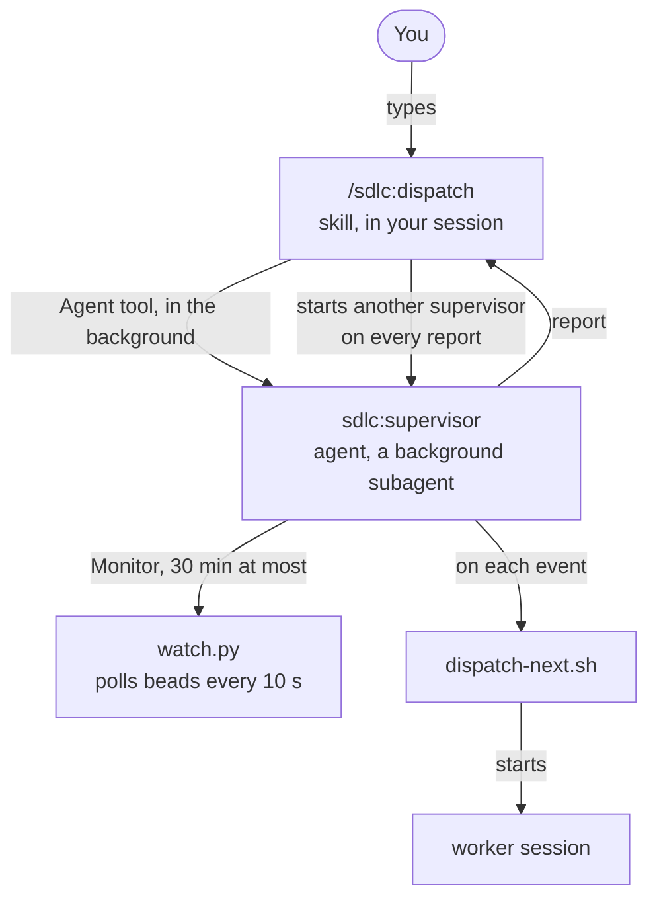
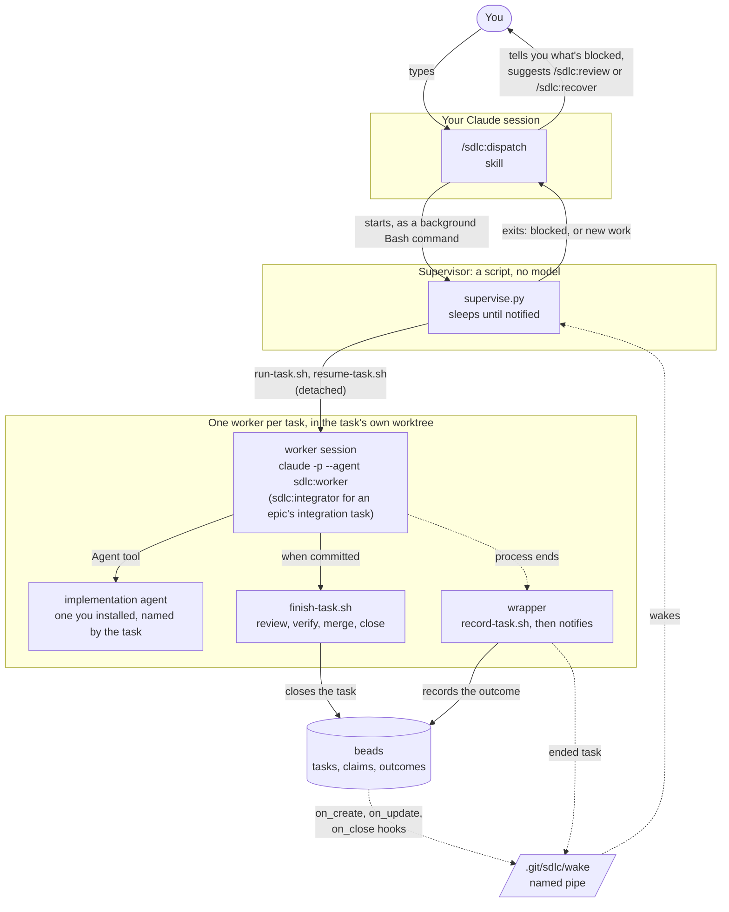
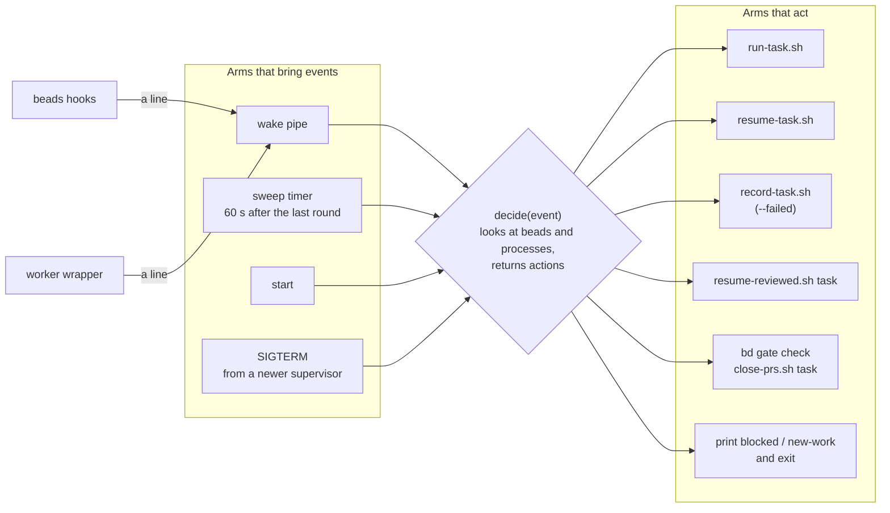
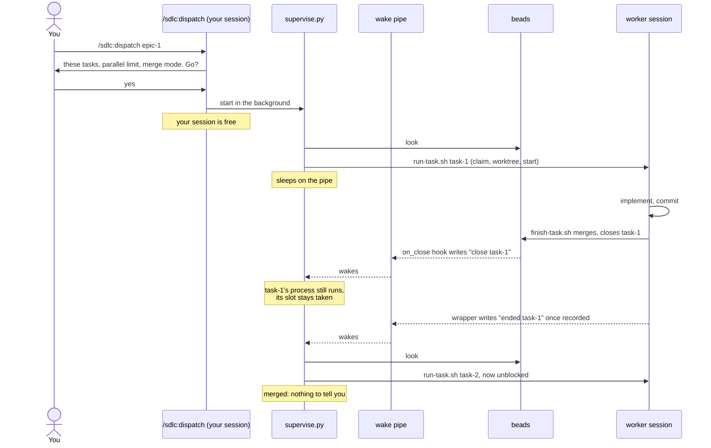
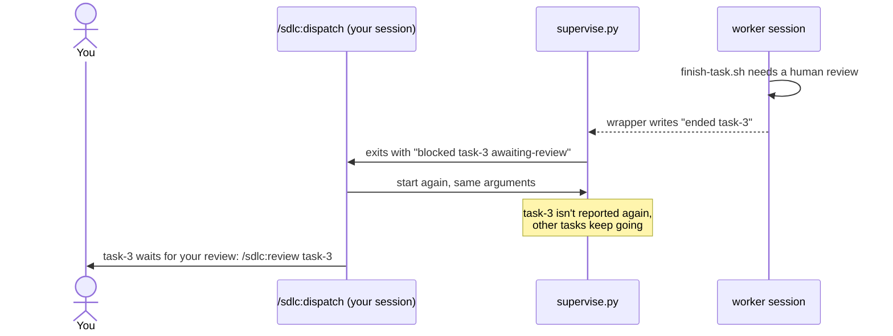
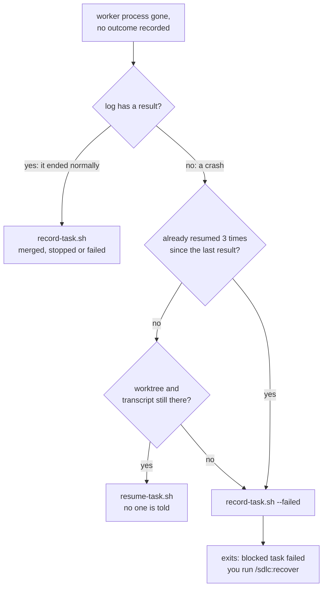
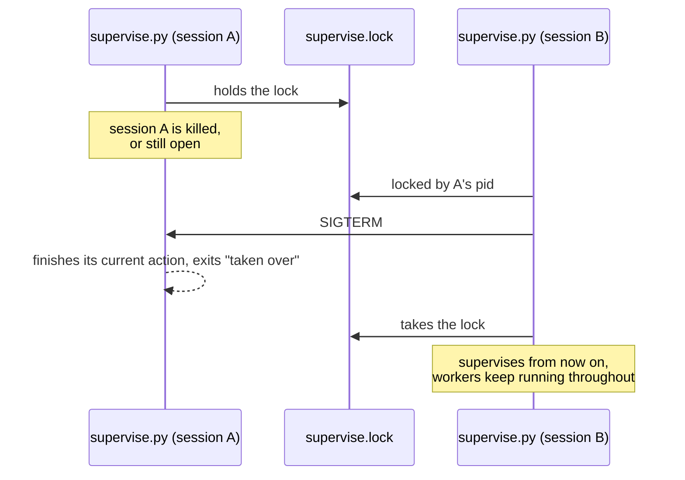

# Dispatch, supervisor and workers: how they fit

This is the picture behind `docs/plan-supervisor.md`.

## The three kinds of pieces

- **Skill:** a prompt that runs in the Claude session where you type it, such as `/sdlc:dispatch`.
- **Agent:** a system prompt for a separate Claude session, such as `sdlc:worker`.
- **Script:** a program with no model. It costs no tokens and does the same thing every time.

## Today, and why it breaks

1. The supervisor is a subagent, and a subagent has to hand back as soon as it stops to wait. It reports "done" while its watch keeps running.
2. Its watch dies after 30 minutes, and nothing starts it again.
3. `/sdlc:dispatch` starts a new supervisor for every report, so several of them run at once.
4. The agent starts tasks while `watch.py` is reading beads, so `watch.py` misreads the task's state and reports false `crashed` and `idle` events.

## Planned: who starts what

| Piece | Kind | Runs where | Model | Lives until |
|---|---|---|---|---|
| `/sdlc:dispatch` | skill | your session | your session's | the end of each turn; it's woken again only when the script exits |
| `supervise.py` | script | a background command of your session | none | something is blocked, new work shows up, or another supervisor takes over |
| `sdlc:worker` / `sdlc:integrator` | agent | its own `claude -p` process, in the task's worktree | Sonnet, unless the task says otherwise | its task merges, or it stops for a person |
| implementation agent | agent you installed | inside the worker session | its own frontmatter | its piece of work is done |
| beads hooks | scripts `/sdlc:init` installs | run by `bd` after every write | none | one line written |
| `run-task.sh`, `resume-task.sh`, `finish-task.sh`, `record-task.sh` | scripts | called by the pieces above | none | one call |
| `/sdlc:review`, `/sdlc:recover` | skills | your session, when you type them | your session's | one call |

The only model left in supervision is your session, and it runs only when a person is needed.

## Inside supervise.py: one brain, several arms

- **Events only say why to look.** The brain decides from a fresh look at beads and the processes, so a lost or doubled event can't cause a wrong decision. A lost event only waits for the next sweep.
- **The sweep is the only polling.** It runs 60 s after the last round. It logs any change no event announced, which shows whether it can be stretched.
- **Swapping an event source touches one arm.** For example, a future `bd activity --follow` would replace the beads hooks without changing the brain.

## Life of a task that merges

## When your session wakes

The script exits, and wakes your session, only for:
- **Blocked:** awaiting review, stopped, failed, a pull request waiting for a person to merge, or a ready task that won't start.
- **New work:** tasks outside the ids you dispatched became ready. It asks whether to dispatch them too.
- **Taken over:** another session started its own supervisor.

Starts, merges, epics closing and everything finishing don't wake it.

## A worker whose process is gone

A crash means the process died without writing how it ended: it was killed, the machine restarted, or the Claude CLI itself died. API errors and usage limits aren't crashes. The worker writes its result, and the task shows as `failed`.

## Supervising from another session

Only one supervisor runs per repository. It holds a lock file, `.git/sdlc/supervise.lock`.

Workers run detached, so killing a session or its supervisor never stops them. A new `/sdlc:dispatch` picks them up where they are.
