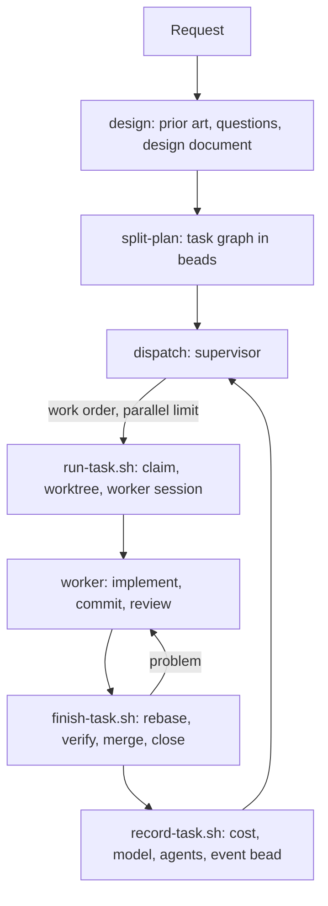

# Workflow

sdlc moves a request through three phases. Each phase is a skill, so you can run any one of them on its own, or all of them with `/sdlc:build`.



## 1. Design

`/sdlc:design <request>` writes a design document. Its job is to remove ambiguity and fix the contracts that separate pieces of work must agree on. Implementation steps are left to the split.

- **Prior art:**
  - **local sources, always used:** earlier designs, docs, code, and existing beads
  - **external sources:** MCP servers such as a wiki, Notion or Drive, skills, and web search. It asks before using them, or uses what the request needs in a headless session.
- **Questions:** it asks only where the answer changes a contract, a goal or the scope. In a headless session it records assumptions instead.
- **Output:** a document, by default in `docs/design/<slug>.md`, or in `design_dir`, or following the repository's convention. It contains a prior-art section, open questions and assumptions, and whichever of goals, definition of done, glossary, contracts and decisions the request needs.

Reading is delegated to a cheap reading agent. The planning skills run on Opus and only think about what comes back.

## 2. Split

`/sdlc:split-plan [docs] [prompt]` turns a design document, a plan made in plan mode, or a plain prompt into a beads task graph. The agent decides its shape: one or several epics, tasks, subtasks. Each task gets:
- a description, and acceptance criteria
- a **scope**: the path prefixes it changes. Tasks that don't wait for each other don't share paths.
- a **verify command**: one short command that exits 0 when the acceptance is met. It must exercise the behaviour, so a syntax check alone doesn't count, and it may only rely on files that exist once the task's dependencies are done.
- a **complexity** (small, medium, large) and a **domain**
- **dependencies**: tasks wait for shared interfaces before using them

Once the graph exists, `bd swarm validate` checks it for cycles and parts that aren't connected. `/sdlc:split-task <id>` splits an existing bead the same way. `/sdlc:create-task` creates a single task.

In plan mode, split-plan writes the graph into the plan instead, and creates it once the plan is approved.

## 3. Dispatch

`/sdlc:dispatch [epic]` is the supervisor: a Claude Code session, on Sonnet, that starts and follows workers. It holds no state of its own. Everything lives in beads and on disk, so any session can take over at any time.

1. **Look:** `workers.sh` shows dispatched tasks and their state. `next-tasks.sh` shows ready tasks in work order.
2. **Handle crashed and stopped workers.** A crashed worker is resumed, reported, or proposed for reopening. A stopped worker is reported with its reason.
3. **Dispatch:** `dispatch-next.sh` starts ready tasks up to the parallel limit.
4. **Follow:** `watch.sh` runs under the Monitor tool and prints an event for each task that becomes ready, each worker that ends or crashes, and each epic that closes. The supervisor reacts to each event, until nothing is running and nothing is ready.

### Work order

1. Tasks of epics already in progress (a task claimed or closed), highest epic priority first.
2. Then tasks of other epics, and tasks without an epic, by priority.
3. Within an epic: the tasks that unblock the most others first, then priority, then the oldest.

A task is dispatchable when it is ready in beads, has no children, and has a verify command, or is an integration task.

## The worker

A worker is one headless Claude Code session, running in one task's worktree, that owns that task until it is closed.

1. **Start:** `run-task.sh` claims the task. In the same update it records the session id, base branch, branch, host and start time. It then creates the worktree with `wt switch --create`, and starts `claude -p` detached with `setsid`, so the worker outlives whoever dispatched it.
2. **Implement:** the worker implements the task, or hands it to an installed agent, as your configuration decides. It commits, and reviews the change when it judges that worthwhile.
3. **Finish:** the worker runs `finish-task.sh`. While holding the merge queue of its base branch, the script:
   - checks that work is committed and no tracked file is left modified
   - rebases onto the base
   - runs the verify command
   - fast-forwards the base
   - closes the task

   If a step fails, it prints the reason, and the worker fixes the problem, for example by resolving a conflict with a sibling's change, and runs it again.
4. **Can't finish:** the worker comments on the task saying what's missing, and stops.
5. **Record:** when the process ends, `record-task.sh` records the attempt and removes the worktree of a merged task.

Hooks keep the worker on this path (see [configuration](configuration.md#hooks)):
- **SessionStart** restates the lifecycle after a resume or a compaction.
- **PreToolUse** denies `bd close`, `wt merge` and `git push` outside `finish-task.sh`.
- **Stop** blocks the first attempt to end while the task is open and the worker hasn't commented.

Setting `execution_agent_type` on a task makes the worker session run as that agent. That agent's frontmatter then picks the model.

## Integration modes

| Mode | Tasks branch from and merge into | When an epic's tasks are done |
|---|---|---|
| `direct` (default) | the target branch | the epic closes |
| `epic-merge` | the epic branch `<epic-id>` | an integration task merges the epic branch into the target |
| `epic-pr` | the epic branch | an integration task pushes it and opens a pull request |

The **integration task** is created on an epic's first dispatch. It waits for every other task of the epic. It is a worker like any other, and its prompt is only to merge, which may mean editing code when the target moved or the tasks don't fit together. Its `finish-task.sh` runs the verify command of every task in the epic.

In `epic-pr` mode, the integration task gates itself on the pull request with a `gh:pr` gate. `watch.sh` runs `bd gate check`, and `close-prs.sh` closes the task and the epic once the pull request is merged.

To review an epic before it is integrated, add a gate to its integration task:

```bash
bd gate create --type=human --blocks <integration-task> --reason "review the epic branch"
```

## Merge queues

Every branch that tasks merge into has a queue, so merges into it happen one at a time, on every machine that shares the beads database. A queue is an ephemeral bead, which `bd ready` and `bd list` don't show. Holding it means having claimed that bead. `merge-queue.sh` creates, takes and releases queues.

## Crash recovery

A worker's state lives in beads, its worktree and its logs, so nothing is lost when a process or the machine dies:
- **A crashed worker** has `dispatch_state=running`, no process running its session, and no result in its log.
- **Diagnosis:** `workers.sh` prints the evidence to decide on resuming: worktree, commits, uncommitted files, whether the Claude transcript exists, the last events, stderr, and the boot time.
- **Resuming:** `resume-task.sh` starts `claude -p --resume <session>` in the same worktree, so the worker continues its own conversation.
- **After a reboot:** run `/sdlc:dispatch`. It resumes crashed workers when the cause is gone, and reports those it shouldn't retry, such as a usage limit or a failure that repeats.

## Observing

- `/sdlc:status`: workers, the ready queue and settings
- `/sdlc:stats [epic]`: cost, duration, models and agents, per task and per epic
- `/sdlc:logs <task>`, or `skills/dispatch/scripts/logs.sh <task> [--follow]` in a terminal: what each attempt did
- `claude --resume <session> --fork-session`: a worker's whole conversation, without changing it
