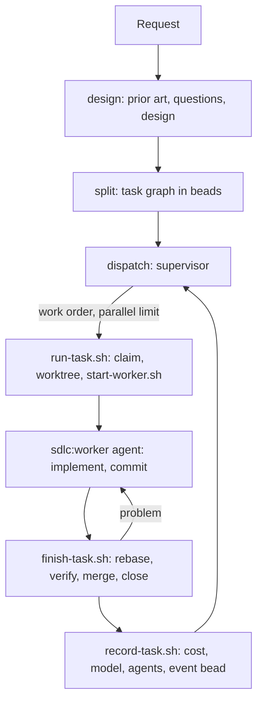

# Workflow

sdlc moves a request through three phases. Each phase is a skill, so you can run any one of them on its own, or all of them with `/sdlc:build`.



## 1. Design

`/sdlc:design <request>` states a design in the session. Its job is to remove ambiguity and fix the contracts that separate pieces of work must agree on. Implementation steps are left to the split.

- **Prior art:**
  - **local sources, always used:** earlier designs, docs, code, and existing beads
  - **external sources:** MCP servers such as a wiki, Notion or Drive, skills, and web search. It asks before using them, or uses what the request needs in a headless session.
- **Questions:** it asks only where the answer changes a contract, a goal or the scope. In a headless session it records assumptions instead.
- **Output:** the design, stated in the reply (or in the plan file, in plan mode): a prior-art section, open questions and assumptions, and whichever of goals, definition of done, glossary, contracts and decisions the request needs. It also edits existing docs — a README, an ADR, API docs, an earlier design — wherever this design makes them wrong or incomplete. It writes a new document only when the user asks for one, at the location the request names, then the repository's existing convention, then `docs/design/<slug>.md`.

Reading is delegated to the `sdlc:reader` agent. The planning skills run on Opus and only think about what comes back.

## 2. Split

`/sdlc:split [docs] [prompt]` turns design docs, a design or plan stated earlier in the conversation, or a plain prompt into a beads task graph. The agent decides its shape: one or several epics, tasks, subtasks. Each task gets:
- a description, and acceptance criteria
- a **scope**: the path prefixes it changes. Tasks that don't wait for each other don't share paths.
- a **verify command**: one short command that exits 0 when the acceptance is met. It must exercise the behaviour, so a syntax check alone doesn't count, and it may only rely on files that exist once the task's dependencies are done.
- a **complexity** (small, medium, large)
- **dependencies**: tasks wait for shared interfaces before using them

Once the graph exists, `bd swarm validate` checks it for cycles and parts that aren't connected. `/sdlc:split <id>` splits an existing bead the same way. `/sdlc:create-task` creates a single task.

Split always creates beads, then shows the graph for approval. It doesn't run in plan mode.

## 3. Dispatch

`/sdlc:dispatch [epic]` confirms what's about to happen with the user, then starts the `sdlc:supervisor` agent (`agents/supervisor.md`), on Sonnet, in the background, and follows what it reports. The supervisor holds no state of its own — everything lives in beads and on disk, so any session can take over at any time — and it can't ask the user anything, so it reports what it wants instead of deciding, leaving that to `/sdlc:dispatch`.

1. **Look:** `workers.py` shows dispatched tasks and their state. `next-tasks.py` shows ready tasks in work order.
2. **Handle crashed and stopped workers.** A crashed worker is resumed or reported; one whose transcript or worktree is gone is reported, with what reopening it needs, for `/sdlc:dispatch` to ask the user and act on. A stopped worker is reported with its reason.
3. **Dispatch:** `dispatch-next.sh` starts ready tasks up to the parallel limit.
4. **Follow:** `watch.py` runs under the Monitor tool and prints an event for each task that becomes ready, each worker that ends or crashes, and each epic that closes. The supervisor reacts to each event, until nothing is running and nothing is ready, then reports back.

### Work order

1. Tasks of epics already in progress (a task claimed or closed), highest epic priority first.
2. Then tasks of other epics, and tasks without an epic, by priority.
3. Within an epic: the tasks that unblock the most others first, then priority, then the oldest.

A task is dispatchable when it is ready in beads, has no children, and has a verify command, or is an integration task.

## The worker

A worker is one headless Claude Code session, running as the `sdlc:worker` agent in one task's worktree, that owns that task until it is closed. Its system prompt (`agents/worker.md`) carries the whole lifecycle below, so it survives a compaction or a resume.

1. **Start:** `run-task.sh` claims the task. In the same update it records the session id, base branch, branch, host and start time. It then creates the worktree with `wt switch --create`, and calls `start-worker.sh`, which builds the `claude -p --agent sdlc:worker` command and starts it detached with `setsid`, so the worker outlives whoever dispatched it.
2. **Implement:** the worker implements the task itself, or hands it to the agent named by the task's `execution_agent_type` metadata (or to whatever the user's CLAUDE.md asks for). It commits. It doesn't review its own change or start a reviewer agent, even when the user's CLAUDE.md asks for one: `finish-task.sh` runs the review the task's review level asks for (see review levels).
3. **Finish:** the worker runs `finish-task.sh`, which:
   - checks that work is committed and no tracked file is left modified
   - reviews the change, per the task's review level (below)
   - takes the merge queue of the base branch, then rebases onto the base, runs the verify command, runs the project's own pre-merge checks and fast-forwards the base
   - closes the task

   The review comes before the queue, so a slow review doesn't hold up merges of sibling tasks.

   If a step fails, it prints the reason, and the worker fixes the problem, for example by resolving a conflict with a sibling's change, and runs it again.
4. **Can't finish:** the worker comments on the task saying what's missing, and stops.
5. **Needs a person:** some problems aren't the worker's to fix: the project's pre-merge checks aren't approved on this machine, or a human review is pending (see review levels). `finish-task.sh` exits 3, the worker records why with `bd comments add` and stops; nothing else needs to happen, since `/sdlc:dispatch` and `resume-reviewed.sh` pick the task back up once a person has acted.
6. **Record:** when the process ends, `record-task.sh` records the attempt and removes the worktree of a merged task; a task waiting on a human review keeps its worktree.

## Review levels

Each task has a review level, `--review none|agent|human` on `create-task.sh`, defaulting to `bd config custom.dispatch.review` (itself defaulting to `none`). `finish-task.sh` enforces it, after the committed check and before the merge:

- **`none`:** no review, straight to merging.
- **`agent`:** a separate reviewer session (an installed `reviewer` agent if there is one, otherwise a plain Sonnet session) runs `/sdlc:review <task>` (`skills/review/SKILL.md`), with `--json-schema` structuring its verdict. On approval, the merge continues. On requested changes, `finish-task.sh` exits 1 with the findings, the worker fixes them and runs it again. After 3 rounds it exits 3: a person is needed.
- **`human`:** a gate (`bd gate create --type=human`) blocks the task, `dispatch_state` becomes `awaiting-review`, and `finish-task.sh` exits 3. The worker stops. Once a person runs `/sdlc:review <task>` and resolves the gate (approve or request changes, both run `bd gate resolve <gate>`), `resume-reviewed.sh` (run by `watch.py`, after `close-prs.sh`) resumes the worker to read the review's comments and continue.

A task is re-reviewed only when its diff changes: `finish-task.sh` compares a stable patch id (`git patch-id`) against the one last approved, so re-running it after a no-op doesn't ask for another round.

Hooks keep the worker on this path (see [configuration](configuration.md#hooks)); the `sdlc:worker`/`sdlc:integrator` agent's own system prompt, not a hook, carries the lifecycle across a resume or a compaction:
- **PreToolUse** denies `bd close`, `wt merge` and `git push` outside `finish-task.sh`, and denies `bd gate resolve`/`bd gate close` and setting `review` or `dispatch_review*` metadata. Only a person, or `finish-task.sh` itself, moves a review forward.
- **Stop** blocks the first attempt to end while the task is open and the worker hasn't commented.

Setting `execution_agent_type` on a task doesn't change which agent the worker session itself runs as (always `sdlc:worker`, or `sdlc:integrator`); it names the agent the worker hands implementation to, and appears in its prompt.

## Integration modes

| Mode | Tasks branch from and merge into | When an epic's tasks are done |
|---|---|---|
| `direct` (default) | the target branch | the epic closes |
| `epic-merge` | the epic branch `<epic-id>` | an integration task merges the epic branch into the target |
| `epic-pr` | the epic branch | an integration task pushes it and opens a pull request |

The **integration task** is created on an epic's first dispatch. It waits for every other task of the epic. Its worker session runs as the `sdlc:integrator` agent (`agents/integrator.md`), not `sdlc:worker`: its job is only to merge, which may mean editing code when the target moved or the tasks don't fit together, never to add features. Its `finish-task.sh` runs the verify command of every task in the epic.

In `epic-pr` mode, the integration task gates itself on the pull request with a `gh:pr` gate. `watch.py` runs `bd gate check`, and `close-prs.sh` closes the task and the epic once the pull request is merged.

To review an epic before it is integrated, add a gate to its integration task:

```bash
bd gate create --type=human --blocks <integration-task> --reason "review the epic branch"
```

## Merge queues

Every branch that tasks merge into has a queue, so merges into it happen one at a time, on every machine that shares the beads database. A queue is an ephemeral bead, which `bd ready` and `bd list` don't show. Holding it means having claimed that bead. `merge-queue.sh` creates, takes and releases queues.

## Leftovers

A crash between merge and record, or a task reset by hand, can leave a worktree, a branch, or a held merge queue behind. `/sdlc:clean` (`scripts/clean.sh [--apply]`) lists these, one line per item with its reason, and removes them once you approve. It never touches the main checkout, the worktree of a claimed task, or a task whose `dispatch_state` is `stopped`, `failed` or `awaiting-review`: those still need `/sdlc:recover` or a review.

## Project checks

`wt merge` (and, in `epic-pr` mode, `wt hook pre-merge`) runs the project's own `[pre-merge]` commands from `.config/wt.toml` before the merge lands — type checks, linters, unit tests, whatever the project decides. `/sdlc:init` proposes these from `checks.sh`'s scan of the repository (`package.json` scripts, a Makefile or justfile, `pyproject.toml`, `Cargo.toml`, `go.mod`) and adds the ones the user picks.

The first time a command runs on a machine, `wt` needs a person to approve it: `wt merge` fails non-interactively, and `finish-task.sh` treats that as a person-needed problem, not a bug to fix. A person runs `wt config approvals add` once, in the main checkout, and the worker's next `finish-task.sh` run goes through. A failing check, once approved, is a normal problem: the worker fixes it and runs `finish-task.sh` again.

## Crash recovery

A worker's state lives in beads, its worktree and its logs, so nothing is lost when a process or the machine dies:
- **A crashed worker** is claimed (`in_progress` with a `dispatch_session`), but no process runs its session and no attempt outcome is recorded (`dispatch_state` is empty, or `running` on a bead claimed before `dispatch_state` existed).
- **Diagnosis:** `workers.py` prints the evidence to decide on resuming: worktree, commits, uncommitted files, whether the Claude transcript exists, the last events, stderr, and the boot time.
- **Resuming:** `resume-task.sh` calls `start-worker.sh --resume`, which starts `claude -p --resume <session>` in the same worktree, so the worker continues its own conversation.
- **After a reboot:** run `/sdlc:dispatch`. It resumes crashed workers when the cause is gone, and reports those it shouldn't retry, such as a usage limit or a failure that repeats.

## Stopping workers

Workers run detached, so nothing stops one on its own. `scripts/stop-task.sh <task|epic>` ends a task's worker process (TERM, then KILL if it doesn't exit), releases its branch's merge queue, and sets `dispatch_state` to `stopped` with a comment saying a person stopped it — set before the process is signalled and reasserted after, so the task reads `stopped` no matter when `start-worker.sh`'s own `record-task.sh` call lands. Given an epic, it stops every running worker under it, at any depth. `/sdlc:stop [task|epic]` shows what's about to stop, asks, then runs it; `/sdlc:recover` picks a stopped task back up.

## Observing

- `/sdlc:status`: workers, the ready queue and settings
- `/sdlc:stats [epic]`: cost, duration, models and agents, per task and per epic
- `/sdlc:logs <task>`, or `scripts/logs.py <task> [--follow]` in a terminal: what each attempt did
- `claude --resume <session> --fork-session`: a worker's whole conversation, without changing it
